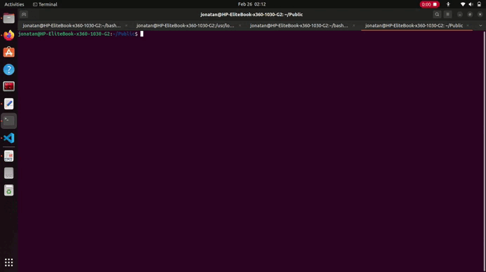

# C_CPP_TEMPLATE_PROJECT_GENERATION
Le but de ce projet est de pouvoir générer automatiquement un répertoire initiale pour le developpement de projet en c ou c++ en utilisant une command système linux. L'outil d'automatisation utilisé ici est le Bash shell.

## Comment installer cette command linux

1. Clone ce repo
2. Clone ce repo et met le dans dans cet emplacement 

> sudo cp genesis  /usr/local/bin/

3. Ajoute les droits de ce fichier 

> cd /usr/local/bin && chmod +x genesis 

4. Ajoute le chemin de ce fichier dans le fichier  ~/.bashrc

La ligne est à ajouter à la fin du fichier 
> export PATH=$PATH:/usr/local/bin/

5. Source le fichier .bashrc
> source ~/.bashrc 

## Demonstration 

